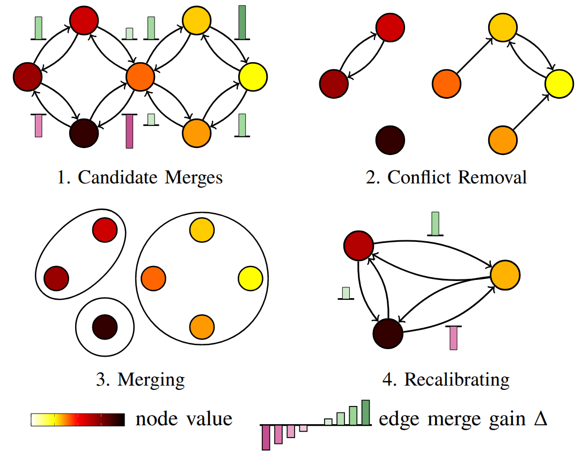

<div align="center">

# torch-graph-components

[](https://www.python.org/)
[](https://pytorch.org/get-started/locally/)
[](https://opensource.org/license/mit)

Official PyTorch implementation for the 
**graph components** and **graph partitioning algorithms**
from
<br>
<br>
[_EZ-SP: Fast and Lightweight Superpoint-Based 3D Segmentation_](https://arxiv.org/abs/2512.00385)
<br>
[](https://arxiv.org/abs/2512.00385)
[](https://doi.org/10.5281/zenodo.18329602)
[](https://louisgeist.github.io/ez-sp/)
<br>
<br>
**If you ❤️ or simply use this project, don't forget to give the repository a ⭐,
it means a lot to us !**
<br>
</div>

## 📌  Description

`torch-graph-components` holds algorithms for fast graph connected 
components and graph partitioning, fully implemented in PyTorch with 
GPU parallelization in mind.

In particular, this project contains two main algorithms:
- `wcc_by_max_propagation` for searching the 
[Weakly Connected Components](https://en.wikipedia.org/wiki/Weak_component)
of a graph in pure PyTorch. We created this to avoid the reliance on
[SciPy's CPU-based computation](https://docs.scipy.org/doc/scipy/reference/generated/scipy.sparse.csgraph.connected_components.html)
found in many PyTorch projects.
- `merge_components_by_contour_prior` for partitioning a graph based on 
the generalized minimal partition problem (GMPP) 
[[Landrieu & Obozinski 2017, SIIMS](https://dl.acm.org/doi/abs/10.1137/17m1113436)]
which we solve approximatively with a greedy heuristic. 
Basically, this algorithm clusters nodes of a graph based on two
objectives:
  - compatibility between values carried by the nodes of a same component
  - complexity of contour of the components

See our [paper](https://arxiv.org/abs/2512.00385) for more details. 
For the official implementation of EZ-SP for superpoint-based semantic 
tasks, see the 
[Superpoint Transformer](https://github.com/drprojects/superpoint_transformer) 
repository.

<p align="center">
  
</p>

<br>

## 🏗 Installation

### 1. Install dependencies
`torch-graph-components` relies on backend libraries
(`torch`, `torch-geometric`, `torch-scatter`).
These dependencies are **not bundled** and must be installed manually
by the user because they depend on:

- Python version
- PyTorch version
- CUDA version
- Operating system

```bash
# Specify your torch and and CUDA versions
export TORCH_VERSION=2.7.0
export CUDA_VERSION=cu126

# Install torch
# https://pytorch.org
pip install torch==${TORCH_VERSION} --index-url https://download.pytorch.org/whl/${CUDA_VERSION}

# Install PyTorch Geometric and PyTorch Scatter
# https://pytorch-geometric.readthedocs.io
pip install torch-scatter torch-geometric -f https://data.pyg.org/whl/torch-${TORCH_VERSION}+${CUDA_VERSION}.html
```

### 2. Install the project
```bash
pip install torch-graph-components
```

<br>

## 🚀 Usage

```python
import torch
from torch_graph_components import wcc_by_max_propagation
from torch_graph_components import merge_components_by_contour_prior

device = 'cuda'  # choose your device
N = 10  # number of nodes
E = torch.tensor([
    [0, 2, 3, 2],
    [1, 3, 4, 4],
], dtype=torch.long, device=device)  # edges

X = torch.rand(N, 3, device=device)  # node features
S = torch.ones(N, device=device)  # node weights
W = torch.rand(E.shape[1], device=device)  # edge weights
reg = 0.05  # regularization term
min_size = 1  # minimum component size

# Compute the weakly connected components. Returns the final component
# assignment as a tensor of node-wise indices. 
# See code documentation for more details
I_wcc, _ = wcc_by_max_propagation(N, E, verbose=True)
print(I_wcc)

# Partition the graph. Returns the final component assignment as a 
# tensor of node-wise indices, along with other merged attributes. 
# See code documentation for more details
I_merged, _, _ = merge_components_by_contour_prior(
    X,
    S,
    E,
    W,
    reg,
    min_size,
    verbose=True)
print(I_merged)
```

<br>

## 👩‍🔧  Troubleshooting
Here are some common issues and tips for tackling them.

> ⚠️ If you experience:
> - segmentation faults
> - crashes during import
> - low-level runtime errors
>
> These issues are almost always caused by **incompatible backend 
> dependencies installations**. Please ensure that the dependencies were
> properly installed by running, in python:
> ```python
> import torch
> import torch_geometric
> import torch_scatter
> ```

<br>

## 💬 Citing our work
If your work uses all or part of the present code, please include the following a citation:

```
@article{geist2025ezsp,
  title={EZ-SP: Fast and Lightweight Superpoint-Based 3D Segmentation},
  author={Geist, Louis and Landrieu, Loic and Robert, Damien},
  journal={arXiv},
  year={2025},
}
```

Also, **if you ❤️ or simply use this project, don't forget to give the 
repository a ⭐, it means a lot to us !**
